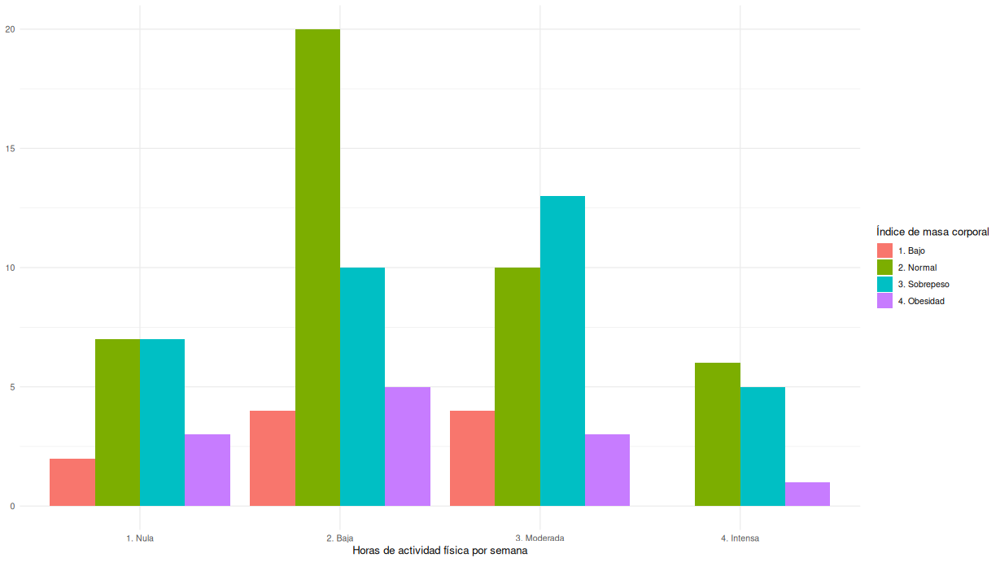

# imc-test-estadistica

En este proyecto, se realizó un análisis estadístico mediante una tabla de contingencia para determinar si existe relación entre el número de horas de actividad física por semana y el índice de masa corporal en base a 100 respuestas obtenidas mediante una encuesta anónima.

